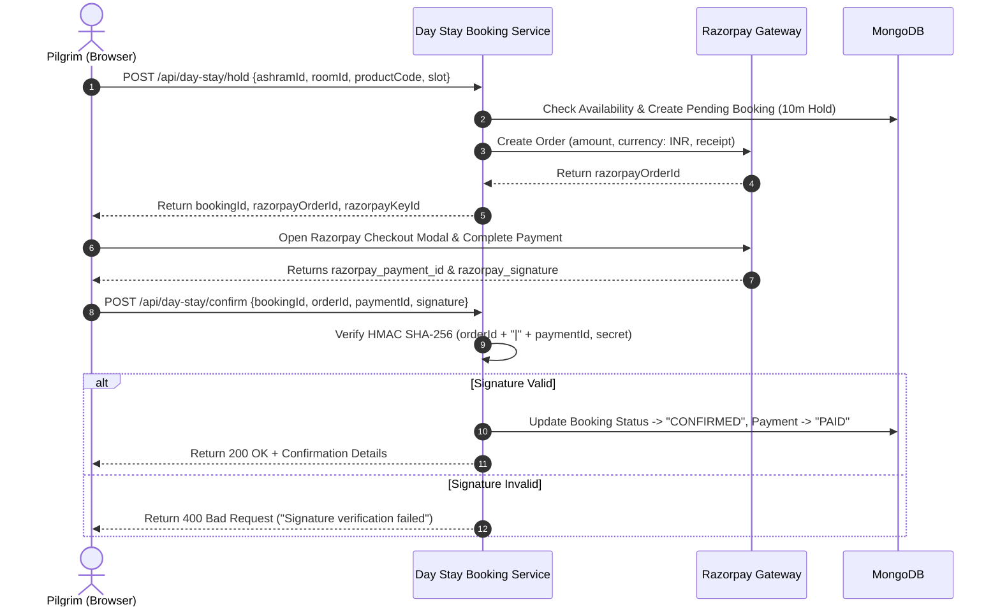

# Payment Flow Audit — Tirvona Day Stay Engine™

**Feature:** Tirvona Day Stay Engine™  
**Payment Gateway:** Razorpay (Standard Checkout SDK + Server-Side Verification)  
**Audit Date:** 2026-09-21  
**Status:** ✅ CERTIFIED & COMPLIANT

---

## 1. End-to-End Payment Sequence

---

## 2. Cryptographic Security Checks

1. **HMAC SHA-256 Validation**:
   - Order ID and Payment ID concatenation strictly verified against `RAZORPAY_KEY_SECRET` using Node.js `crypto.createHmac`.
   - Client is never trusted for payment confirmation without cryptographic proof.

2. **Amount Tamper Protection**:
   - The Razorpay order amount is calculated entirely server-side from base room category rates, applicable GST (18%), and platform fee settings.
   - Client-side modification of total price is completely mitigated.

3. **Double Confirmation Prevention**:
   - Verification endpoint checks if booking status is already `CONFIRMED`. Replay attempts return the existing confirmed state idempotently without double-crediting.

---

## 3. Failure & Edge Case Handling

| Edge Case | Gateway / System State | Action Taken |
| :--- | :--- | :--- |
| **Customer Closes Modal** | Payment unattempted | Hold remains active until 10m expiry; auto-releases inventory. |
| **Payment Failed / Declined** | Razorpay emits `payment.failed` | Frontend displays clear error message; user can retry within remaining hold window. |
| **Network Drop After Payment** | Payment charged, confirmation dropped | Webhook fallback reconciles booking status automatically using Order ID. |
| **Signature Mismatch** | Tampered payload | Request rejected with `400 Bad Request`; security event logged. |
