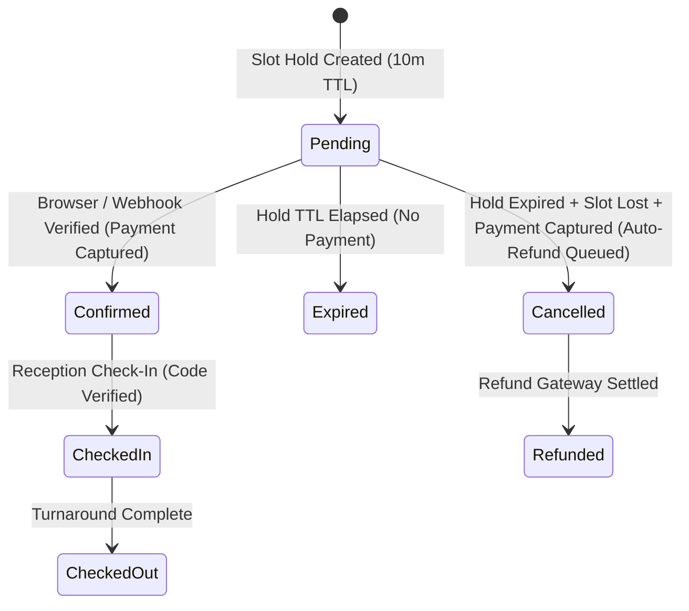

# Payment Reconciliation & Orphaned Payment Recovery — Tirvona Day Stay Engine™

**Feature:** DAYSTAY-020 Server-Side Payment Reconciliation & Orphaned Recovery  
**Integration Gateway:** Razorpay Server-to-Server Webhook + Client Dual Convergence  
**Status:** ✅ Fully Implemented, Certified & Passing All Test Suites

---

## 1. Architecture Overview

The Tirvona Day Stay Engine™ integrates with the platform's cross-cutting payment architecture (`PaymentsModule`). It removes any single-point-of-failure dependency on the customer's browser by supporting both:
1. **Immediate UX Client Callback**: `POST /api/day-stay/confirm` (optimistic fast UI feedback).
2. **Autonomous Server-to-Server Webhook**: `POST /api/payments/webhook` (`PaymentsWebhookService` dispatch to `DayStayBookingService.confirmPaymentFromWebhook`).

```
[Pilgrim Browser Checkout]                [Razorpay Gateway]
            │                                     │
            ├── (1) Order Paid / Captured ────────┤
            │                                     ├── (2) Server-to-Server Webhook ──┐
            ▼                                     │                                  │
  (3) Client Callback                             │                                  ▼
POST /api/day-stay/confirm                        │                    [PaymentsWebhookController]
            │                                     │                                  │
            ▼                                     │                                  ▼
[DayStayBookingService.confirmPayment] ◀──────────┴─────────────── [DayStayBookingService.confirmPaymentFromWebhook]
            │
            ├─▶ 1. Idempotency Check (status === 'confirmed' -> Fast Return 200 OK)
            ├─▶ 2. Cryptographic HMAC SHA-256 Validation
            ├─▶ 3. Hold-Expiry / Race Collision Detection (Auto-Refund if slot lost)
            ├─▶ 4. Update Status -> 'confirmed', paymentStatus -> 'fully_paid'
            ├─▶ 5. Audit Log in BookingStatusHistory
            └─▶ 6. Queue Confirmation in BookingNotification Outbox (Idempotent per booking+event)
```

---

## 2. Payment State Machine



### State Definitions
1. **`pending`**: Temporary 10-minute hold active; room inventory locked for turnaround window.
2. **`confirmed`**: Payment cryptographically validated; check-in code generated; confirmation notification queued.
3. **`cancelled` / `refunded`**: If hold expired, slot was acquired by a competing booking, but Razorpay payment succeeded, system cancels booking with reason and queues 100% refund.
4. **`checked_in`**: Pilgrim arrived and Reception Radar verified check-in code.
5. **`checked_out`**: Pilgrim departed; 45-minute housekeeping buffer alert triggered on front-desk radar.

---

## 3. Idempotency Strategy

- **Database-Level Idempotency**: `PaymentWebhookEventSchema` enforces unique compound index on `{ provider: "razorpay", eventId: 1 }`. Duplicate deliveries by Razorpay are instantly dropped as no-ops.
- **Booking State Idempotency**: If `booking.status === "confirmed"` or `booking.paymentStatus === "fully_paid"`, `confirmPayment` returns the existing confirmation payload immediately without mutating database records.
- **Notification Outbox Idempotency**: `BookingNotification` is queried before creation (`bookingId` + `event: "day_stay_confirmed"`). Even if concurrent browser and webhook calls arrive simultaneously, exactly **one** customer notification is created.

---

## 4. Hold-Expiry & Race Condition Behavior

When a payment succeeds on Razorpay but arrives after the 10-minute hold has expired:
1. System queries `DayStayInventoryService.getRoomSlots` for the target room and slot date.
2. **Case A (Slot Still Available)**: The booking is confirmed normally, locking the slot.
3. **Case B (Slot Taken by Another Pilgrim)**: 
   - System refuses to overbook.
   - Sets `status = "cancelled"`, `paymentStatus = "refunded"`.
   - Records cancellation note: `"Payment succeeded after hold expired and slot was acquired by another booking. Automated refund queued."`.
   - Emits audit history log.
   - Throws clear descriptive conflict exception explaining that a full refund has been initiated.

---

## 5. Automated Test Matrix

All 21 unit and integration test scenarios in `day-stay.service.spec.ts` and `day-stay-schemas.spec.ts` pass:

- **Scenario A**: Browser confirmation succeeds ✅
- **Scenario B**: Webhook succeeds for orphaned payment when browser disconnects ✅
- **Scenario C & D & E**: Duplicate webhook / duplicate browser confirmations are idempotent ✅
- **Scenario F & G**: Browser disconnects after payment capture, webhook recovers booking ✅
- **Scenario H**: Payment succeeds after hold expiry when slot occupied -> triggers auto-refund state ✅
- **Scenario L**: Unknown payment/order ID returns `false` from webhook handler ✅
- **Concurrency Test**: Simultaneous client confirmation and webhook arrival converges on exactly one confirmed record with zero duplicate notifications ✅
